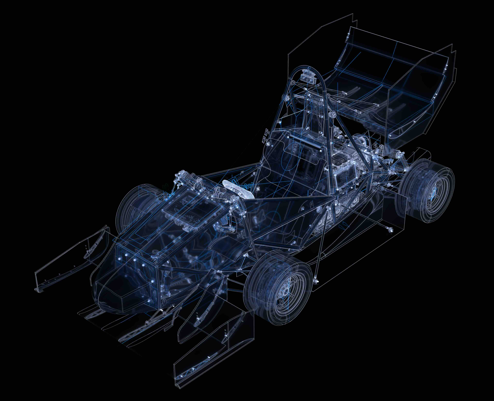

# step-to-usd

<p align="center">
    
</p>


## Overview 

step-to-usd is a system for meshing STEP files into renderable USD assets. The gist is as follows:

- Meshing parameters are passed as USD attributes, with support for variant parameters on entire assemblies and invididual prototypes. This purist representation composes cleanly with USD.
- Surface meshes aren't the only geometric primitive in town. Wireframes extracted from BRep surface boundaries and sketch primitives are generated alongside them which can be a launching point for tremendous look development.
- Iteration is fast. After a STEP file is parsed, `step-to-usd` caches the internal OpenCascade representation — cutting rerun initiaization time. Better still, users can target individual prims for remeshing rather than reprocessing the entire assembly every time. 
- Cross-platform. Nothing in this project is tied to a specific OS or execution environment.

## Getting Started

### Dependencies

**OpenUSD** — as of this writing, USD isn't available via any package manager and must be [built from source](https://github.com/PixarAnimationStudios/OpenUSD/blob/dev/BUILDING.md).

**OpenCascade** — ships with `brew`. Otherwise, [build from source](https://github.com/Open-Cascade-SAS/OCCT/blob/master/dox/build/build_occt/building_occt.md).

### Basic Example

Create a scene like the one below and run `StepUsdTesselate -i your_scene.usd`. Example models can be found in `test/`. See [USING.md](docs/USING.md) for more.

```usda
#usda 1.0
(
    defaultPrim = "WonderfulModel"
    metersPerUnit = 0.001
    upAxis = "Z"
)
def StepTessellationOptions "DefaultOptions" {
    double step:meshAngularDeflection = 0.1
    double step:meshLinearDeflection = 0.1
    # other options...
}
def StepContainer "WonderfulModel" {
    asset step:sourceAsset = @../step/model.STEP@
    def StepPrototypes "Prototypes" {
        rel step:defaultParams = </DefaultOptions>
    }
}
```
## Future Directions

- By default the generated meshes have poor topology so an alternate meshing scheme could go a long way in reducing potential rendering artifacts and triangle counts. Instant meshes would be a great starting point [(Jakob et al., 2015).](https://dl.acm.org/doi/epdf/10.1145/2816795.2818078) There is potentially a path towards a 'BRep guided' solution where the the smoothness energy and tangent fields are guided by sampling BRep topology instead of relying exclusively on one extracted from the mesh.
- Have a system for propagating `StepTesselationOptions` using USD collections.
- The tool enforces an asset structure that is quite rigid. There may be some wiggle room to not only provide more options, but have some sort of plugin system for the meshing routine incase users would like to extract their own information from the brep representation (eg a curvature texture map). It could sort of be like writing a vertex shader.
- Some diff tooling for handling assembly changes. Right now the prototypes use a name and a hashed ID based on the prototype they point to and the their location in the assembly. There is a world inwhich a part is relocated or renamed and updates are propagated to other USD assets.
- Adding python bindings would open doors for faster iteration and dcc integration. Some of options are enabled by default (to reduce prim counts) but might need to be enabled later in very ad hawk manner (eg. GeomSubsets). In addition, the OpenCascade assembly document could be kept in memory during the 'setup' phase.
- Proper test cases and CI
