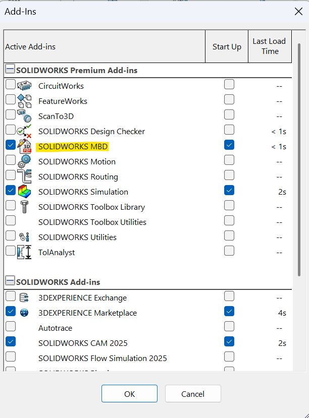
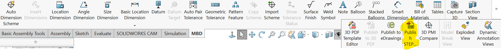
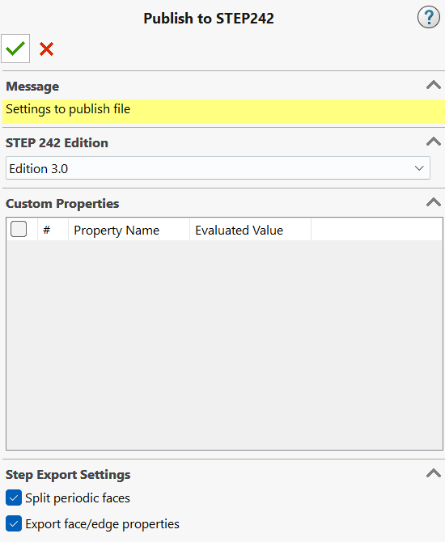

# Step Standard

Much like C++, there is a lineage of adding features to the core STEP specification. Solidworks supports all 3 STEP of the major export standards: AP203, AP214, and AP242 with each building features upon its predicescor. Though the tool supports all three (and others), AP242 is most prefered as it includes sketches.

| Feature            | AP203                                            | AP214                                            | AP242                                                               |
|--------------------|--------------------------------------------------|--------------------------------------------------|---------------------------------------------------------------------|
| Purpose            | General STEP format for parts and assemblies     | AP203 with color support                         | AP214 with added PMI (Product and Manufacturing Info)               |
| Geometry & Topology| Defines geometry, topology, and configuration data for solids | Includes all AP203 data             | Includes AP214 data plus PMI                                        |
| Color Support      | Not supported                                    | Supported (color management)                     | Supported (color and texture management)                            |
| PMI Support        | Not supported                                    | Not supported                                    | Supported (color and PMI data)                                      |
| Assemblies         | Supports solids and assemblies                   | Supports solids and assemblies with colors       | Supports assemblies with detailed PMI for manufacturing             |
| Industry Use       | Common in mechanical engineering                 | Preferred in automotive industry                 | Used for design-to-manufacturing communication                      |

*Table 1. Comparison of STEP file formats (AP203, AP214, AP242). Source: [Schirmer et al. (2025).](https://doi.org/10.3390/electronics14010190)*

# Exporting STEP from Solidworks 2025

## Important Notes 
Solidworks embeds visiblity information into the STEP file. It is mostly standard though in some cases the STEP file may not match (In my testing, it may not even match between CAD tools either).

## Stardard
You know the drill (File -> Export), select STEP. This method only supports AP203 and AP214, so we won't get sketches.

## Using the MBD Tool (Prefered)
This will take longer and is more involved, but you'll get extra goodies.

1. Make sure to enable to MBD extension. Under Tools -> Add-Ins.

2. Once enabled there should be a tab 'MDB'. All the way on the right. There is an option 'Publish STEP 242 File'. If your using a laptop this may be hidden behind an arrow toggle.

3. On the left panel, there will be a menu that has options. Click and drag a box around the parts you'd like to export. If exporting the whole car, make sure to get everything. Enable both the *Split periodic faces* and *Export face/edge properties* options. Click check and wait; this can take a while. If the export fails or the program crashes disable the aformentioned options. 

